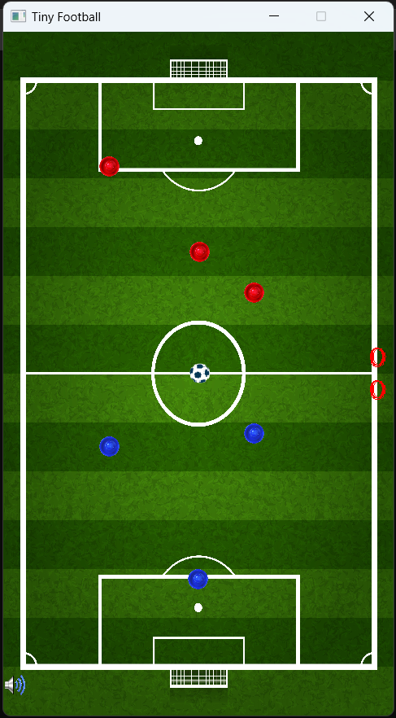

# TinyFootball

### The C++ project with SDL library of Microsoft Visual Studio.

#### What to do to run the project:

1. Clone the repository to you OS directory (for example 'C:\projects\tiny_football').
2. Just build, all lib is in this.

#### Control in the game:

- quit the game - "q" or closed the window
- on/off sound - "m" or LMB on the speaker

##### only on the main menu:

- start the game - LMB on 'START'
- change difficulty - LMB on the difficulty

##### only during the game:

- pause - "p"
- return to the main menu - RMB or "Esc"
- control the bit-player
  - WASD for player 1
  - UP DƠWN LEFT RIGHT for player 2

### Sample

